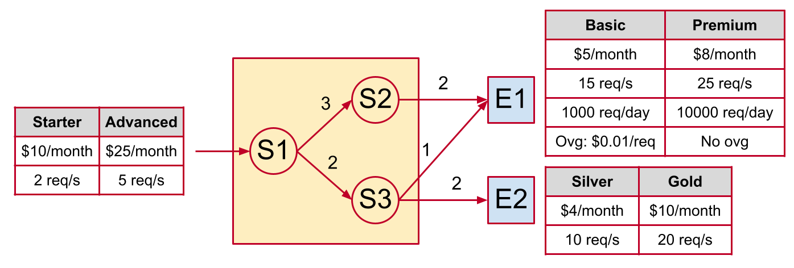
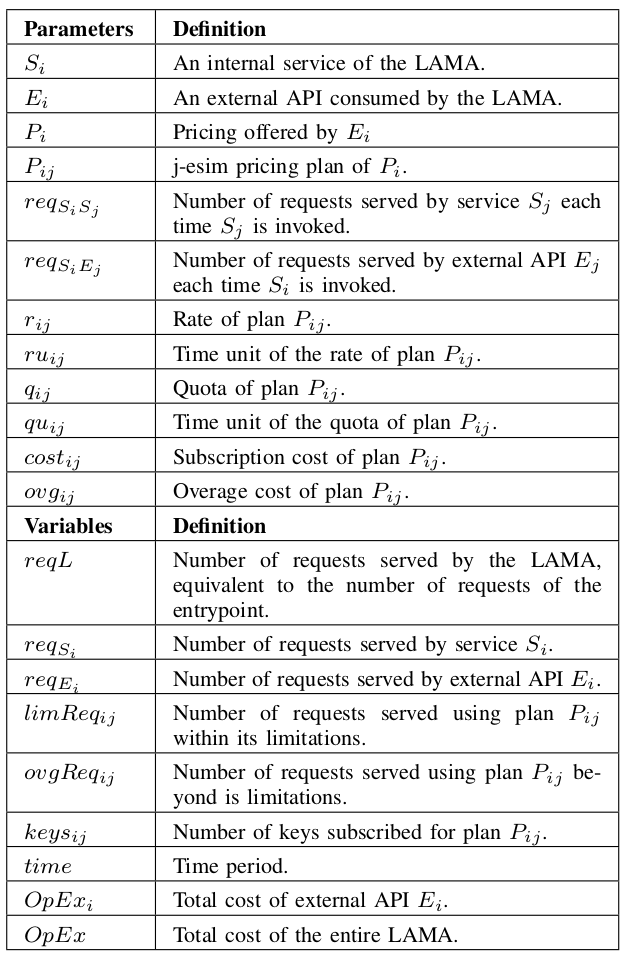
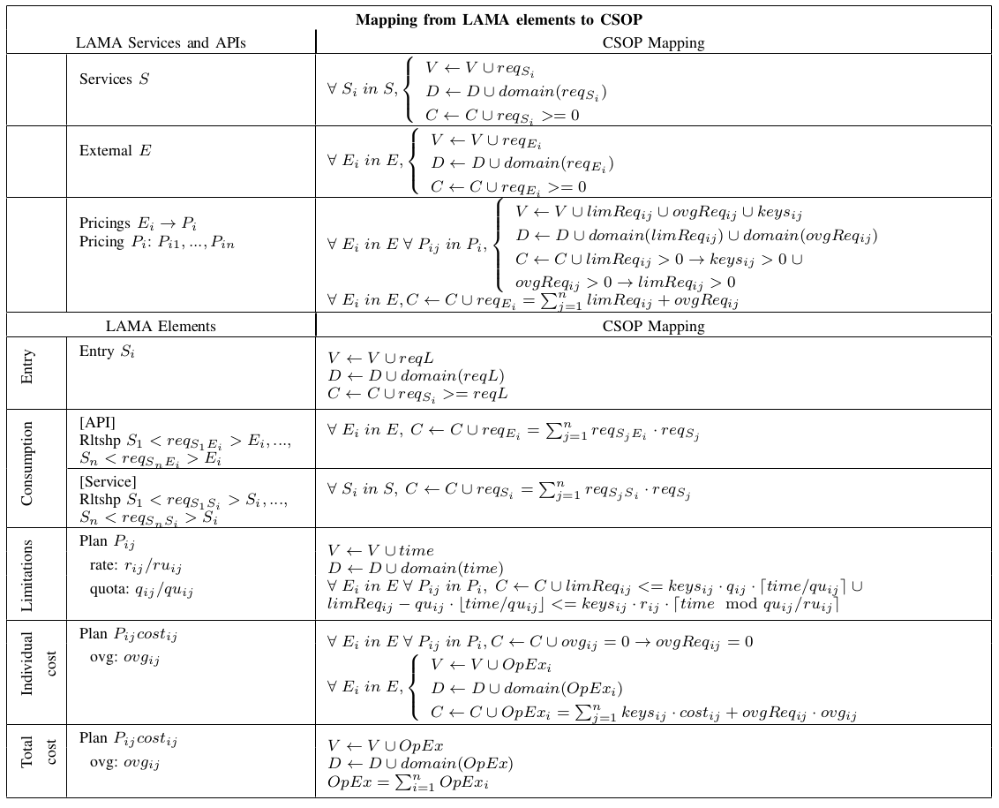

# GECON 2022 - Semi-Automated Capacity Analysis of Limitation-Aware Microservices Architectures
This repository contains additional information for the paper entitled *Semi-Automated Capacity Analysis of LAMAs*. It provides further details about transforming a LAMA into a CSOP that could not be included in the paper due to lack of space.


## Contents
1. [Example of a LAMA](#example-of-a-lama)
2. [Formal Description of a LAMA](#formal-description-of-a-lama)
3. [Glossary](#glossary)
4. [CSOP Mapping](#csop-mapping)


## Example of a LAMA
For every example included in this repository we will use the same LAMA in Fig. 1 of the paper. Its diagram is shown in the picture below. It has three internal services (S1, S2 and S3) and two external APIs (E1 and E2). Each external API has two different pricing plans with their corresponding prices and limitations. The LAMA offers two pricing plans to its users, and has a single entrypoint (S1).




## Formal Description of a LAMA
Before transforming a LAMA into a CSOP, it must be described using a formal description language. As a first approach, we present *LAMA-DL*, a simple description language that includes all relevant information about a LAMA that is needed to create the CSOP. The example below shows the formal description of the LAMA in Fig. 1 using LAMA-DL. It contains all different elements that can be modelled, such as rates, quotas and overage costs.

```
Services S1, S2, S3
External E1, E2
Entry S1
Relationships S1 <3> S2, S1 <2> S3, S2 <2> E1, S3 <1> E1, S3 <2> E2

Pricings E1 -> P1, E2 -> P2
Pricing P1: Basic, Premium
Plan Basic: $5/month
  rate: 15/s
  quota: 1000/day
  ovg: $0.01
Plan Premium: $8/month
  rate: 25/s
  quota: 10000/day
Pricing P2: Silver, Gold
Plan Silver: $4/month
  rate: 10/s
Plan Gold: $10/month
  rate: 20/s
```


## Glossary
To help understand the CSOP mapping in the next section, the figure below shows a glossary of all parameters and variables that are used. *Parameters* refer to values that are obtained from the description of a LAMA and are fixed. *Variables* refer to values that are unknown at the beginning of the execution of the CSOP model and will be determined at the end.




## CSOP Mapping
The figure below shows the mapping of each element and relationship of a LAMA to CSOP elements. A CSOP has three main elements: variables (*V*), domains (*D*) and constraints (*C*). For each fragment of a generic LAMA-DL example, the figure shows its corresponding mapping to a CSOP. Further details of each mapping are included in the paper.


